# Minesweeper

A clone of the popular Minesweeper game made with Python and the Arcade module.

## Gameplay Demo

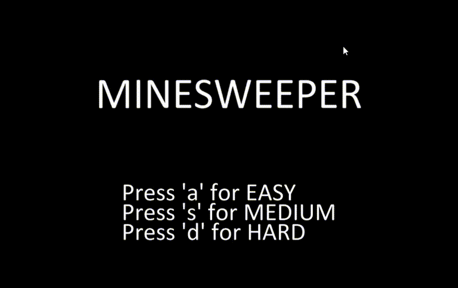

## Features
Allows for Easy, Medium, and Hard difficulty Boards

Incorporates Flagging/Chording

Keeps track of time elapsed, and saves your best time between games as your high score
## Installation Instructions
Requires: Python, Arcade

Clone/Download the source code to your computer, then install Arcade with the following command:
```bash
pip install arcade
```
Run "main.py" to play the game.
```bash
python main.py
```

## How To Play
### Objective
The board is made up of a grid of cells, with mines scattered randomly throughout the board.

The goal is to uncover all of the cells that don't contain mines, without clicking on any of the mines.

The numbers in each cell tell you how many mines are within the proximity of that cell (proximity includes the 8 cells that border the cell in question.)

Through deduction, one must uncover cell-by-cell which cells must have mines, and which ones are safe.
### Controls
Left-Click to reveal a single cell, or Left-Click on an exposed number to "chord" if the corresponding number of flags are already placed in its proximity.

Right-Click to place a flag on an un-revealed cell.

Left-Click on the smiley-face at the top of the window anytime to start a new game.

### Instructions
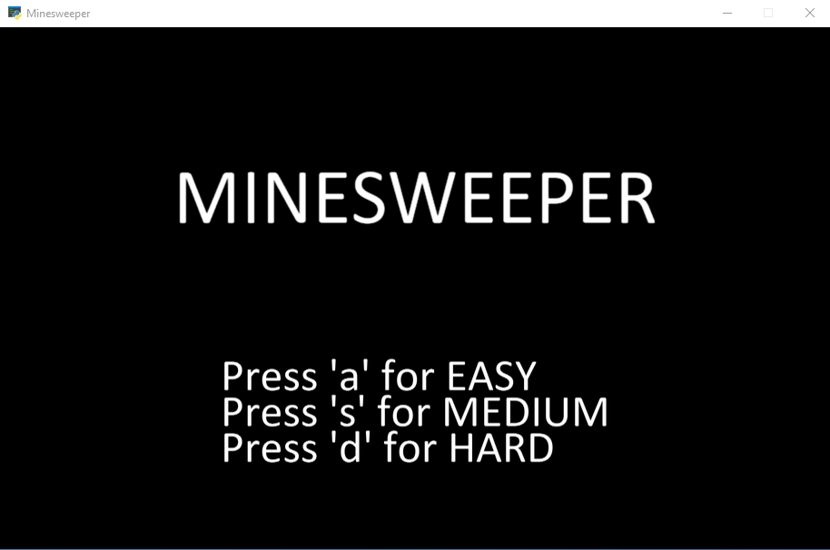

To start a game, select the game mode you wish to play by pressing the corresponding letter.
Game difficulty determines the size of board and the number of mines within the board.

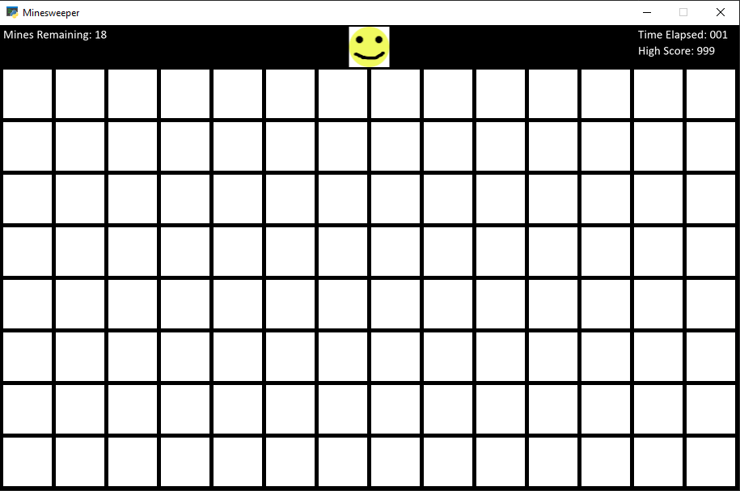

Left-click on any of the cells to get started. Your first click is guaranteed to not be a mine, so no need
to think too hard at this phase!

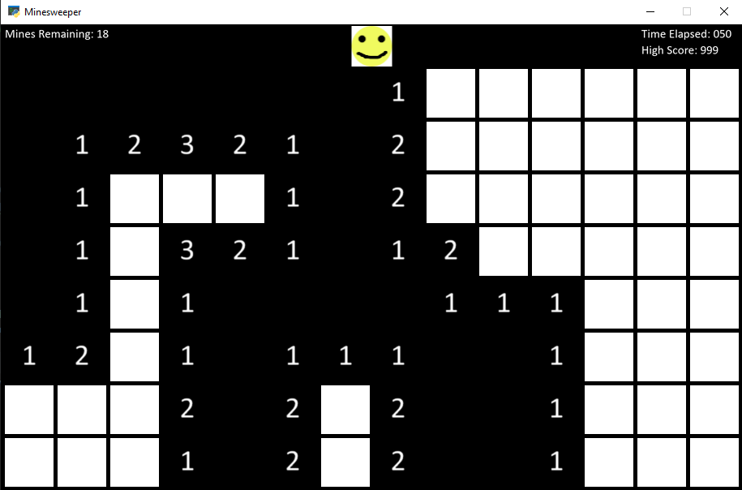

After your first click, all adjacent cells without a proximity number will be exposed. Sometimes this is a large area like shown, other times you will only uncover a single cell.

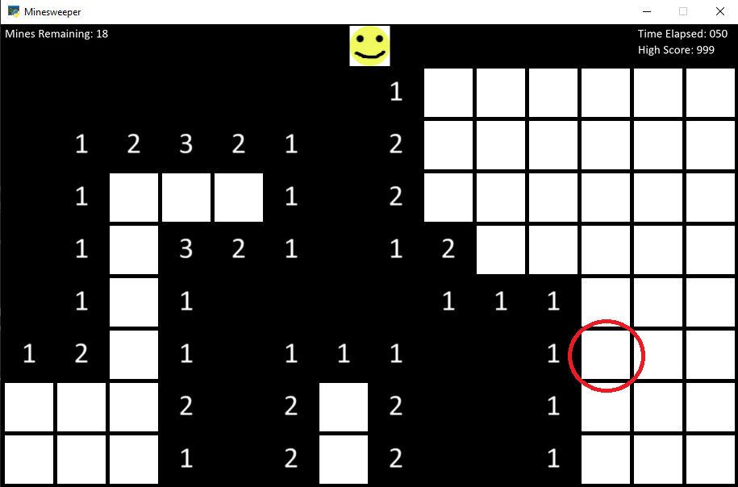

Left-Click on the circled cell to reveal its contents.

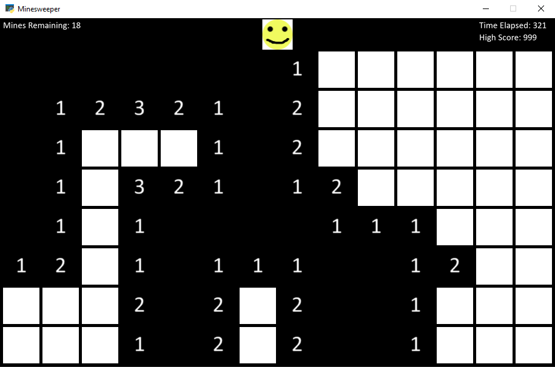

If you know a cell must contain a mine, you can Right-Click on it to place a flag in that cell.

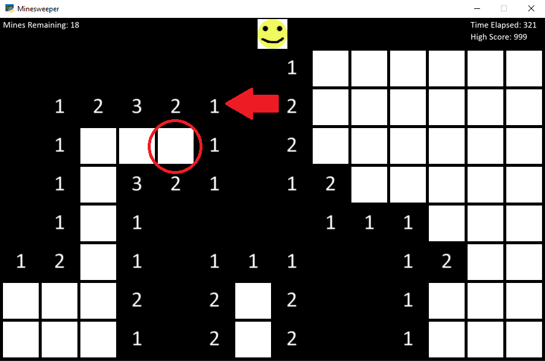

Since the cell with the arrow only has 1 mine adjacent to it, and there is only one un-revealed cell left, that cell MUST be a mine.
By flagging it, we turn the cell green to tell us that there is a mine in that cell. Now, if you try to left-click on the flagged cell, nothing will happen, which saves the player from accidentally clicking on cells with mines.

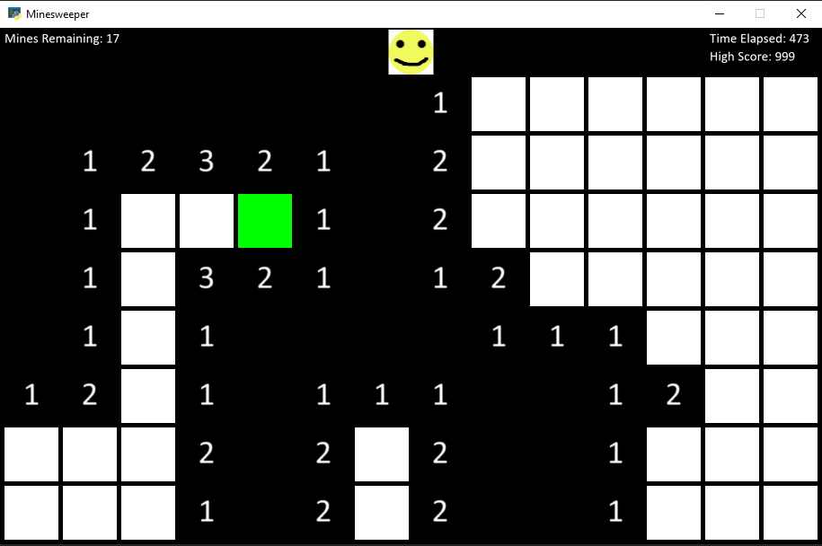

When you have all of the mines accounted for for a particular cell like the "3" below:

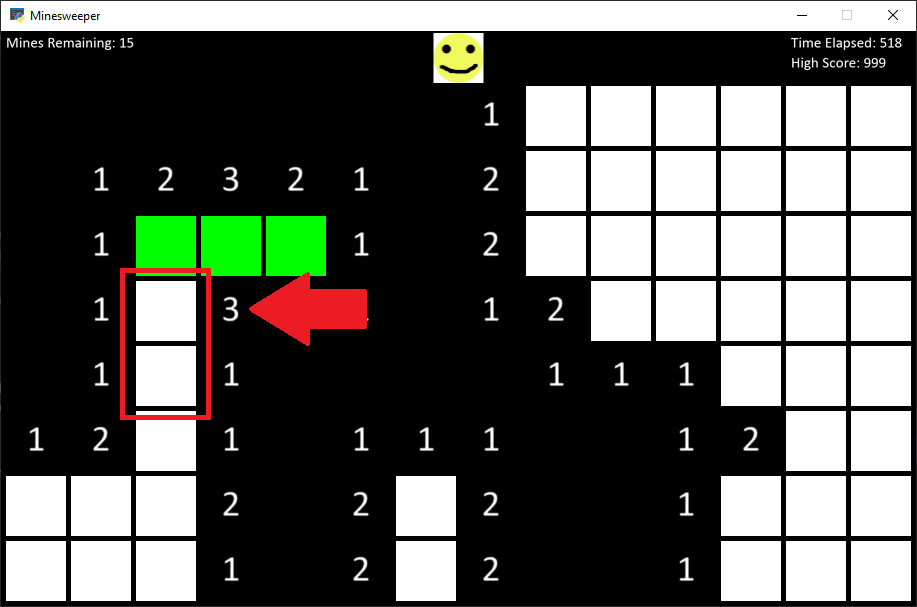

you can Right-Click on the cell to "chord", which uncovers all remaining cells in its proximity.

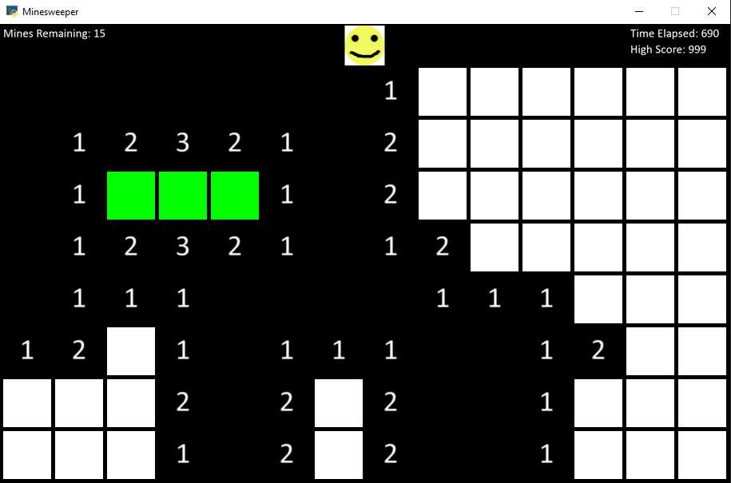

If you do click on a cell that has a mine, the game will immediately end, while revealing the location of all of the mines on the board.

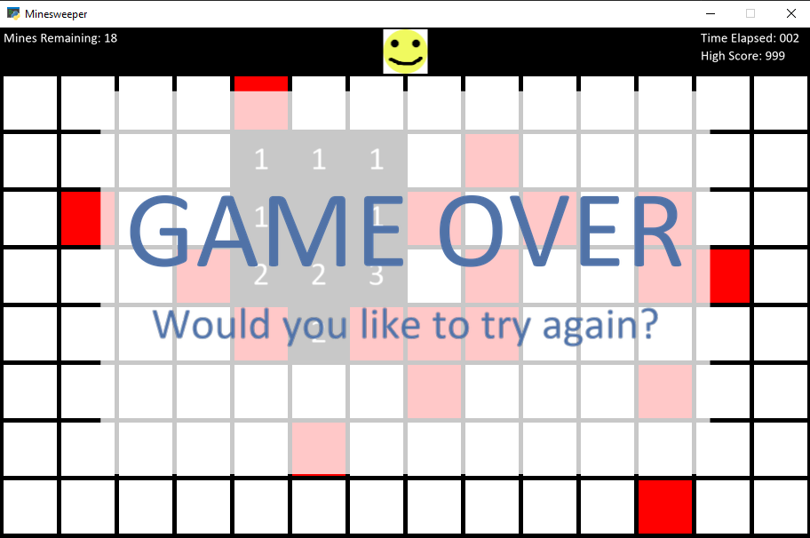

Reveal all of the safe cells without clicking on a single mine, and you will win the game!

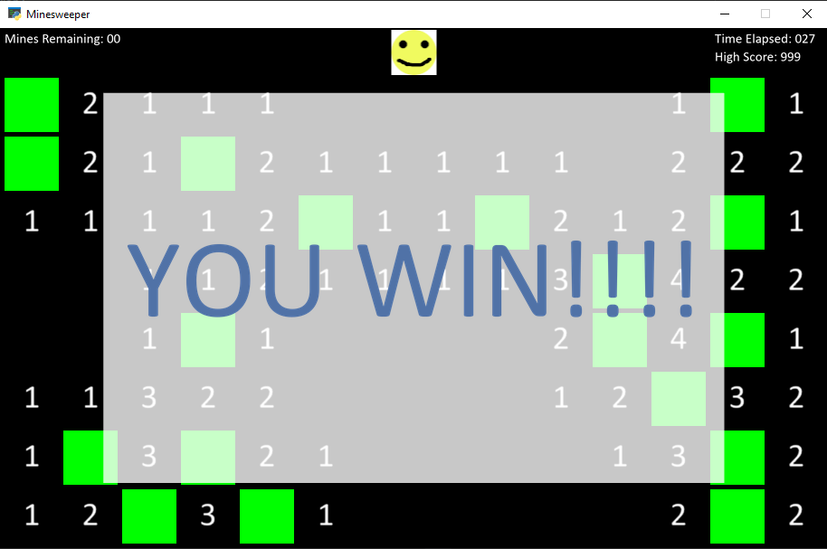
